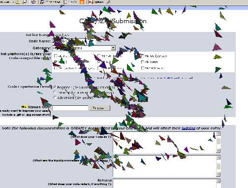



## API\_Poly\_Fill

### Description

Demonstrates Polygon, GetWindowDC, FillRgn API's. The code is based on the 'Ellipse Loader' submission presented by:LCSBSSRHXXX. The primary difference being that this version uses polygons and has color. Feel free to leave comments.
 
### More Info
 

             |
---                |---
**Submitted On**   |2004-05-27 15:47:04
**By**             |[DasVoldus](https://github.com/Planet-Source-Code/PSCIndex/blob/master/ByAuthor/dasvoldus.md)
**Level**          |Beginner
**User Rating**    |4.7 (14 globes from 3 users)
**Compatibility**  |VB 5\.0, VB 6\.0
**Category**       |[Windows API Call/ Explanation](https://github.com/Planet-Source-Code/PSCIndex/blob/master/ByCategory/windows-api-call-explanation__1-39.md)
**World**          |[Visual Basic](https://github.com/Planet-Source-Code/PSCIndex/blob/master/ByWorld/visual-basic.md)
**Archive File**   |[API\_Poly\_F1750795272004\.zip](https://github.com/Planet-Source-Code/dasvoldus-api-poly-fill__1-54047/archive/master.zip)

